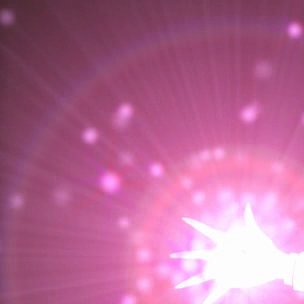
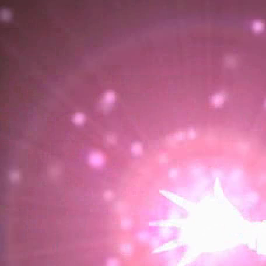
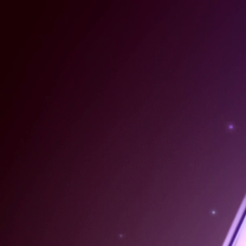
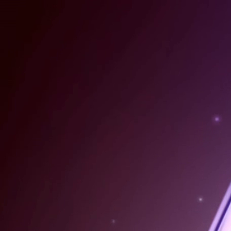
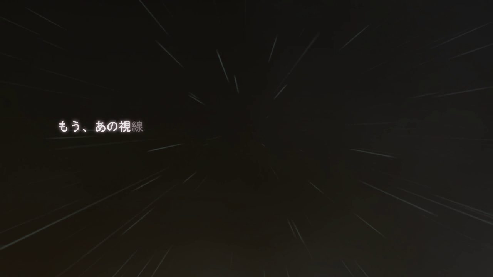
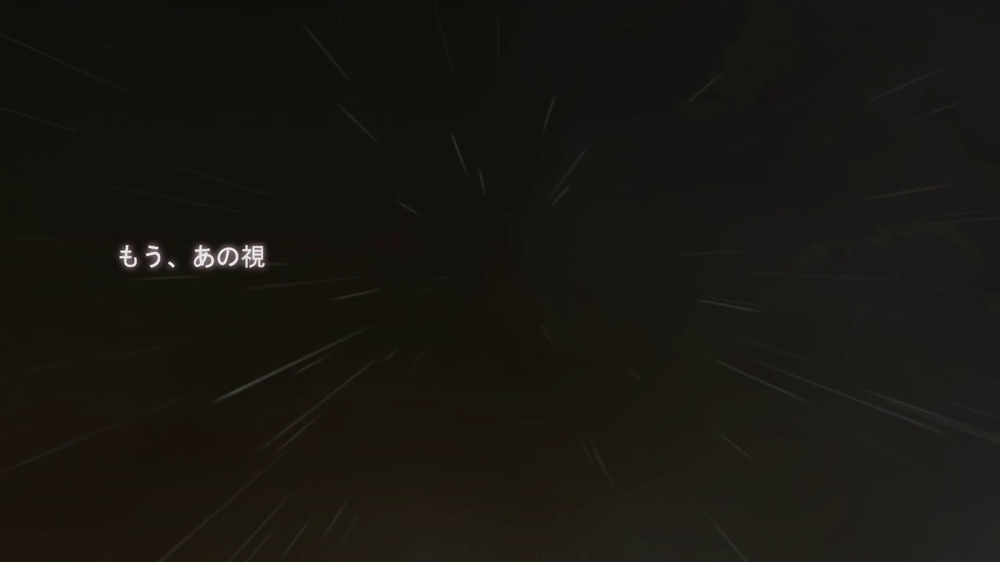

# Chaos;Head NOAH HQ Patch

A higher quality assets patch for the Switch/Steam release of Chaos;Head.

Not only is the English release of Chaos;Head NOAH poorly localized and rife with bugs, the video assets 
have been severely and improperly compressed. The Switch/Steam release is in 1080p, which should have been
an improvement over the original 720p Xbox 360 release. However, there is so much artifacting in the 
images and videos that the perceived quality is actually lower. This patch aims to fix this issue, as well as to 
investigate the quality of other media assets in the game.

# Status

## Tech

Right now, the project is in a standstill as we try to insert videos into the PC release. We're unable to get the 
game to play back H264 video, and there's not much sense in encoding it into MPEG2, as the videos are originally in 
the game. Please open an issue if you can help with this or DM me ptrharmonic#9765.

## Upscale

We've been focused on the opening cutscene, mvinter01, as the test run before we move on to other videos. We have a 
decent upscale of the cutscene, but it needs some additional editing to improve areas where the ML upscale was lacking. 
We're trying to figure out the tech problems first so we can just focus on the upscale afterwards.

# Projects

## Cutscene Upscale

We need to match up the original Xbox cutscenes with the corresponding Switch and Steam files, 
then rescale to 1080p and properly transcode the result. We're going to attempt to do an AI upscale 
to try to and improve the quality a bit more over a simple rescale, you can see some notes about 
that in the [transcoding notes](docs/transcode_notes.md).

### Examples

With the upscale of the opening cutscene nearing completion, here are a few comparisons of frames between the Xbox, 
Steam, Switch, and upscaled versions.

- Note the difference in the godrays and the skirt detail https://imgsli.com/MTUyMzA5/1/3
- Significantly improved bloom, no blocking https://imgsli.com/MTUyMzE2/1/3
- Improved and cleaned up JPEG artifacts from line work, even when zoomed in https://imgsli.com/MTUyMzE1/1/3

### Xbox/Steam Comparisons

The opening cutscene is particularly garish. In general, the visual difference between the 
Switch and Steam release is minimal, so they will be used interchangeably in comparisons.
The Xbox images are smaller because it uses smaller images, the cuts are done proportionally.

There are also some slight changes in color, I'll have to double-check if I messed up the color space.

For this one, notice how the details for the light rays are completely mushed. The hand has 
also been reduced to a single shade of white.
 
| Xbox                                         | Switch/Steam                                    |
|----------------------------------------------|-------------------------------------------------|
|  |  |

There is some banding here too on the Xbox version, but it's far blockier on the Switch/Steam.

| Xbox                                         | Switch/Steam                                    |
|----------------------------------------------|-------------------------------------------------|
|  |  |

Both of these are bad but the Switch/Steam version has far steeper jumps in the gradient.

| Xbox                                    | Switch/Steam                                |
|-----------------------------------------|---------------------------------------------|
|  |  |

### Images/Audio

Image and audio subprojects, further research required to decide if necessary

## BG Image Re-encoding

Background images in the Switch noticeably have more detail and clarity than the Xbox images, however, they 
have slightly more color banding than the Xbox. Doing a color transfer might fix some of that, and maybe a 
run over with a model trained to clean up compression artifacts would help.

### Examples

| Xbox                                 | Switch/Steam                             |
|--------------------------------------|------------------------------------------|
|  |  |

## Switch Audio Re-encoding

There was some concern as to the audio quality for the Switch version since Nintendo's own 
proprietary Opus encoder is [worse than the open source reference one](https://twitter.com/masagratordev/status/1571210220696702977). 
However, in a blind test, I was unable to distinguish the Switch and Steam voice lines. I did notice 
that Nintendo had updated their Opus encoder while I was 
[writing my own to fit their new format in C;H](https://github.com/pmdevita/NXAEncode_ChaosHead), so perhaps 
they have fixed the issue.

# Contributing/Help

Right now, I need some help with matching Xbox assets to Switch/Steam assets. If you've already played 
the game or don't care about spoilers, please add me on Discord ptrharmonic#9765. If you have experience
with Docker and own an Nvidia GPU, I could also use some help with upscaling the videos and images.

# Compatibility with the Committee of Zero Patch

In short, yes. It would be nice to get this included in the patch so please DM me CoZ ptrharmonic#

## Switch

The Switch versions of the cutscenes need to have their subtitles baked in. These can be obtained from the PC release 
of CoZ's patch. 

This is as simple as copying this patch's files over CoZ's, replacing corresponding files.

## PC

This one is a bit more involved. We can replace the videos inside CoZ's CPK package, but it might be more viable to 
make our own CPK file and then patch the language barrier json to use our files. Installing 

