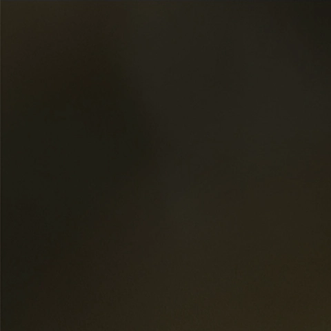

# Chaos;Head NOAH HQ Patch

A higher quality assets patch for the Switch/Steam release of Chaos;Head.

Not only is the English release of Chaos;Head poorly localized and rife with bugs, the assets  
have been severely or improperly compressed. This patch aims 
to fix these issues with a few subprojects.

## Cutscene Re-encoding

In both the Steam and Switch release, the cutscenes are presented in 1080p, upscaled from the original 
720p. However, they are heavily compressed, to such a degree that they are actually lower quality 
than the originals. To fix this, we need to upscale the original videos from the X360 release
and insert them into both the Steam and Switch release. We're going to attempt to do an AI upscale 
to try to and improve the quality a bit more over a simple rescale.

## BG Image Re-encoding

Similarly to the cutscenes, the background images have also been upscaled and then heavily compressed, to 
a point where the original Xbox assets look better. We need to redo the upscale and then properly 
compress them for the Switch and Steam release.

It's a bit difficult to demonstrate in a Readme, but if you zoom into both of these images, you'll notice a lot more 
blocking in the Switch version than the Xbox one. The Xbox image has a smoother gradient.

The Xbox images are smaller because it uses smaller images. The cuts are done proportionally.

| Xbox                                 |Switch|
|--------------------------------------|---|
|  ||

## Switch Audio Re-encoding

Nintendo provides an Opus encoder as part of their SDK for the Switch. For some horrifying reason,
they wrote their own encoder, and it's [worse than the open source reference one](https://twitter.com/masagratordev/status/1571210220696702977).
To fix this, we can re-encode the voice lines and music from the Steam release again for the 
Switch release with a [modified Opus encoder](https://github.com/pmdevita/NXAEncode_ChaosHead) that writes out Nintendo's format.

I was unable to differentiate the voice lines between the Switch and Steam releases in a blind test
so for right now, this project is shelved since returns will likely be minimal to none. Music still 
needs to be investigated.

# Contributing/Help

Right now, I need some help with matching Xbox assets to Switch/Steam assets. If you've already played 
the game or don't care about spoilers, please add me on Discord ptrharmonic#9765. If you have experience
with Docker and own an Nvidia GPU, I could also use some help with upscaling the videos and images.

# Compatibility with the Committee of Zero Patch

CoZ's patch isn't released at the moment, so I'm not entirely sure what the situation will look like. But,
the aim is for this patch to be compatible. The one potential point of friction might be 
with videos that CoZ has subtitled, we'll either need to remake the subs on our own or look into 
some kind of collaboration.
